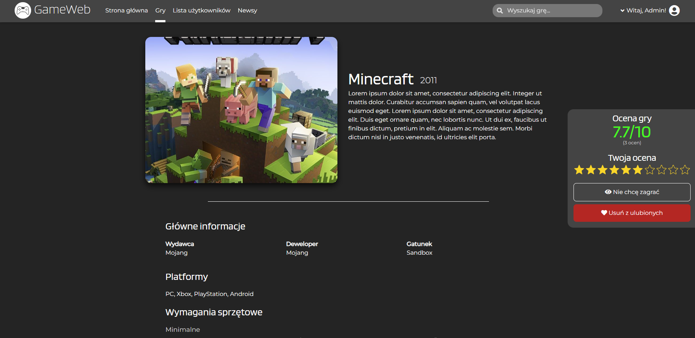
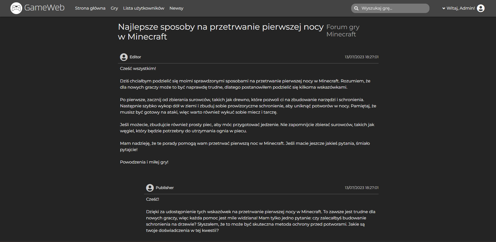
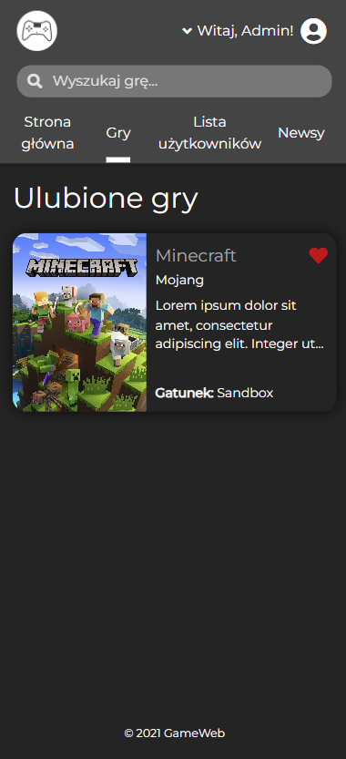

# GameWeb

GameWeb is a website for gamers, where they can read the latest news about the world of gaming, learn about their favourite games, rate them and discuss stuff on forums. It started as a team project written with ASP .NET MVC. It was inspired by Polish website about movies called Filmweb.

## Features

- [x] Role-based authentication
- [x] Creating, reading, updating and deleting articles
- [x] Creating, reading, updating and deleting games
- [x] Rating games
- [x] Wishlisting and adding games to favourites
- [x] Displaying own wishlists and favourite lists
- [x] Searching for games
- [x] Each game has its own forum
- [x] Managing users' accounts
- [x] Users can delete their own accounts
- [x] A somewhat responsive layout

## Screenshots

## Features per role

| Feature                                            | Admin | Editor | Publisher | User | Unauthenticated |
| -------------------------------------------------- | ----- | ------ | --------- | ---- | --------------- |
| Reading articles                                   | ✅    | ✅     | ✅        | ✅   | ✅              |
| Creating, updating and deleting articles           | ✅    | ✅     | ❌        | ❌   | ❌              |
| Displaying games details                           | ✅    | ✅     | ✅        | ✅   | ✅              |
| Creating, updating and deleting games              | ✅    | ❌     | ✅        | ❌   | ❌              |
| Rating, wishlisting and adding games to favourites | ✅    | ✅     | ✅        | ✅   | ❌              |
| Searching for games                                | ✅    | ✅     | ✅        | ✅   | ✅              |
| Reading forums                                     | ✅    | ✅     | ✅        | ✅   | ✅              |
| Adding posts and threads on forums                 | ✅    | ✅     | ✅        | ✅   | ❌              |
| Managing and deleting their own account            | ✅    | ✅     | ✅        | ✅   | ❌              |
| Managing and deleting other users' accounts        | ✅    | ❌     | ❌        | ❌   | ❌              |

## Setup

Just build and run this project using Visual Studio. It should create local database automatically with seeded data.

### Log-in credentials

There are four account seeded for each role:

| Role      | E-mail                |
| --------- | --------------------- |
| Admin     | admin@gameweb.com     |
| Editor    | editor@gameweb.com    |
| Publisher | publisher@gameweb.com |
| User      | user@gameweb.com      |

All accounts use the same password: `Pa$$w0rd`.

The application seeds users automatically if there are no users in the database. You can find the most current seed data in `GameWeb/Data/SeedData.cs` in case you need it.

## Technologies

- C#
- ASP.NET 5 MVC
- Entity Framework Core
- MSSQL
